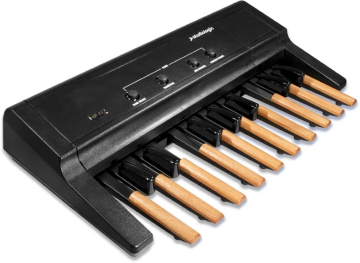
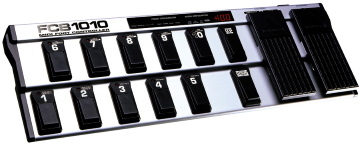
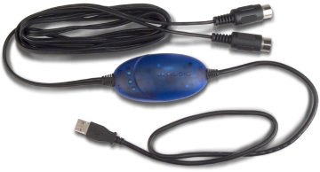
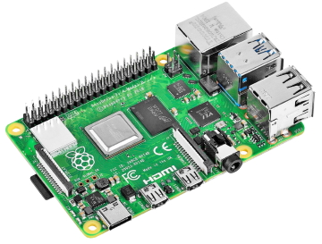

# JMMidiBassPedalController
This software translates NOTE ON/OFF messages comming from a foot controller to chords. It allows you to save several configurations in banks, which can be switched via controller change messages.

**Table of Contents**

[TOCM]

[TOC]

## Features

- XML configuration file.
- Fully customizable parameters:
  - MIDI IN and OUT ports and channels.
  - MIDI Echo function.
  - Setup custom bass note and chord velocities and transpositions.
  - Define multiple banks to store different pedal layouts.
  - Each pedal can send this messages:
    - Bass notes.
	- Chords.
	- Bank select messages.
	- MIDI messages.
	- SysEx messages.
- Its flexibility allows it to be used with several foot controllers at once.

## Definitions
From time to time, I use the following terms on my software:

- **Bank**: in my software I reffer this to be a way of grouping different settings. So, you can have for example a bank with the C Major scale chords and another bank with the C Minor scale chords. The nice thing of these groups is that you can easily switch them while playing your keyboard.

- **Bank select message**: message used to change the active bank to another one, for example: you can navigate to the next, previous, or last banks, or you can eben jump to a specific bank.

- **Bass note:** for me, a bass note is the note that comes when you hit a bass pedal; it is usually the root note of a chord, but since you can setup your pedals as you want, this may not be always the case.

- **Bass pedal controller:** to be honest, I don't know if this term is correct; I think that **pedalboard** may be better, but I want to emphasize that it is a foot controller that looks like those bass pedals from an old organ, for example, the studiologic MP-117:

Please note that it is not necessary that you use a bass pedal controller, you can also use a foot controller like the Behringer FCB1010:

However the feeling won't be the same as when you use a real bass pedal; for example the switches may be harder and so difficult to push. Another advantace of the bass pedal controller is that it may also include the force (velocity) that you use to push an specific pedal.
Finally, you can also use both together, ie: the bass pedal controller for sending your chords and the foot controller to switch between banks and setup other things on your keyboard.

- **CONTROL CHANGE message**: this message allows you to modify several settings on a keyboard or a controller, ie: switch between banks, change modulation and pitch wheel levels, modify the main volume, set several accoustic effects, etc.. In the software, I will use this mainly to switch between banks.

- **Foot controller:** it is basically a MIDI controller that you can manipulate with your feet. It allows you to do some common MIDI tasks, ie: send **NOTE ON**, **NOTE OFF**, **PROGRAM** and **CONTROLLER  CHANGE** messages. There are some that even allow you to send **SYSTEM EXCLUSIVE** messages.

- **MIDI** and related terms: this would cost me a lot of time to write down everything here, so, I will just let you some links:
  -  [Summary of MIDI Messages from the MIDI association.](https://www.midi.org/specifications-old/item/table-1-summary-of-midi-message "Summary of MIDI Messages from the MIDI association.")
  - [MIDI definition from Wikipedia](https://en.wikipedia.org/wiki/MIDI "MIDI definition from Wikipedia")
 - [MIDI tutorial from Dominique Vandenneucker.](http://www.music-software-development.com/midi-tutorial.html "MIDI tutorial from Dominique Vandenneucker.")
 - [How MIDI Works, YouTube playlist from Andrew Kilpatrick.](https://www.youtube.com/watch?v=5IQvu8zlmJk&list=PLgWv1tajHyBsAo5OBLiQlY0hLC4ZagyJB "How MIDI Works, YouTube playlist from Andrew Kilpatrick.")
 
- **MIDI Echo function:** this is the ability of the software to fordward other not recognized messages to the connected devices. ie: let's say that you want to send a **System Exclusive** message, you can do it; the software won't process it, but it will send it through the **MIDI OUT** port.
 
- **Log file:** file where the debug information is going to be stored. It is usally named debug.log and it is located in the same folder of the main program. It is useful to help you detect possible issues that you may have with your equimpment.
 
- **MIDI port:** it is the physical connection where you connect your MIDI cables on the keyboard and your foot controllers. Please note that you can also have virtual ports, which are used inside the software to simulate a real port. You can have **IN** (input) and **OUT** (output) ports to receive and send messages comming from or to other connected devices.

- **MIDI to USB cable**: since modern computers don't have **MIDI ports**, this cable allows you to have two ports: **MIDI IN and OUT** connected through an USB port. Right now, I use M-Audio Uno USB cable:

- **NOTE ON/OFF message:** messages that results when hitting or releasing a note on a keyboard or a foot controller respectively. **NOTE ON** messages are commonly associated with at note velocity. You may also have this on a **NOTE OFF** message, but it is uncommon.

- **Note Transposition:** usually you can move notes by semitones, tones, and octaves, ie: if you have a C3 (middle C), you can transpose it by a semitone, then you get: C#3 or by an octave: C4. On the software, I will only use octave transposition; I don't see any utility on trasposing chords.

- **Note velocity**: it is the pressure you apply to hit a key on your keyboard or bass pedal controller. It is commonly associated to the volume (see MIDI for more details).

- **Raspberry Pi**: think of it as a mini computer (mini controller to be exact), for example, the Raspberry Pi 4:

They are really small and allow you to excecute some tasks that a computer also can do, but with the advantage that they are really small and usually after you setup them, then you don't need a keyboard or a screen to start it.

- **Sequencer software:** since the MIDI message are send sequentially to your keyboard, sequencer is a software that is used to catch those messages or send them. It counts with nice graphical tools, ie: message list (human readable list) and also a staff view to see the note messages.

- **System Exclusive message or SysEx:** this is a way of sending a manufacturer specific message to your keyboard, ie: activate a voice on the keyboard's panel.

- **XML file**: this is just a file where you can save the configuration of your bass foot controller.
